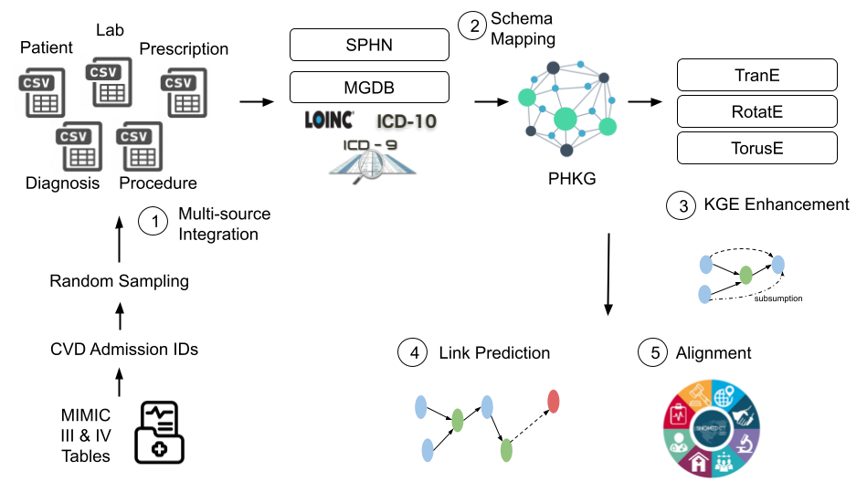
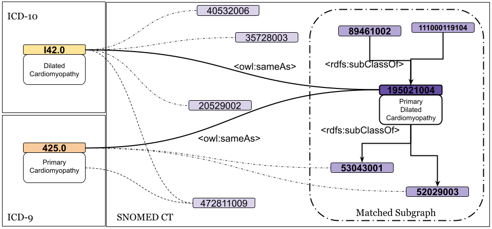
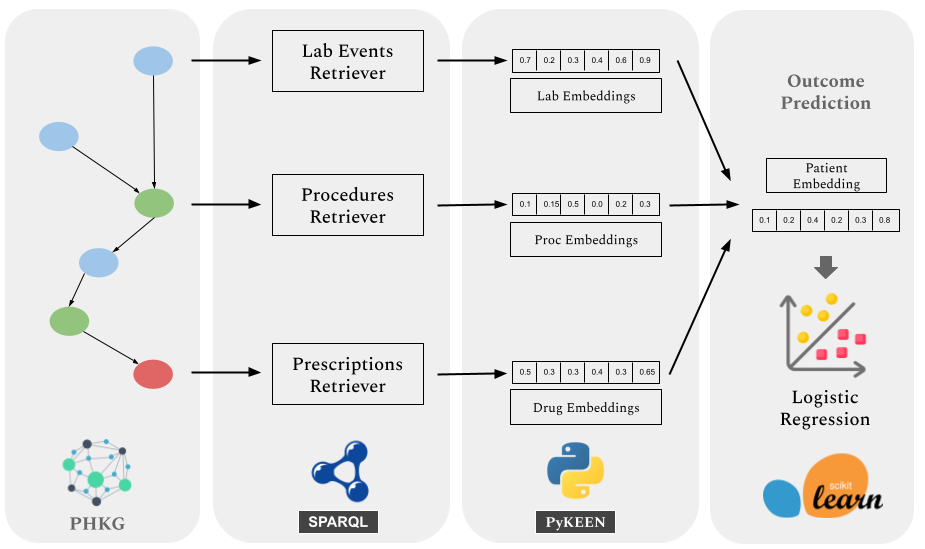

## Knowledge Graph Embedding and Alignment Framework

AIDAVA WP5 Knowledge Graph Embedding source code and workflows. The aim is to identify gaps/improvement points for curation tools such as automated structured mapping, entity alignment, and KG Embedding-based data completion. Each aim is demonstrated based on the developed code as a workflow ipynb. The data processing pipeline is shown below. 

### KG Embedding

### KG Alignment

In order to disambiguate and contextualize knowledge with unified representations, domain specific alignment of data according to clinical and biomedical ontologies can be adopted. Well curated biomedical ontologies exist, such as Systematized Nomenclature of Medicine Clinical Terms (SNOMED CT), that are best suited for medical applications needing high quality and personalized context. Sources which use different vocabularies, for instance the International Classification of Diseases (ICD) for classifying diseases, symptoms, and medical procedures, can benefit from alignment to SNOMED CT. As more sources are aligned with the same domain-specific ontology, it has the added benefit that larger amounts of data are available for model training due to interoperability.

### AI Model Development

In order to extract and apply enriched data for model training in downstream tasks, e.g. diagnosis code prediction, the contextual data must be void of ambiguity. The above operations are done manually or semi-automatically by clinical data stewards, the final PHKG is often incomplete because certain facts are unknown or due to error at multiple possible points in the process. Important context related to a patient’s conditions therefore can be missing in the PHKG that will have a negative effect on decision making. Particularly for the critical care use of AI models, the reliance on data that is well curated plays an important role. To showcase the framework's practical utility, we apply the learned representations to a diagnosis task targeting patients with heart failure conditions. The performance is evaluated using precision, recall, and f1 score, to quantify how much knowledge completion and ontology alignment contribute to data-driven predictive accuracy in critical care settings.

